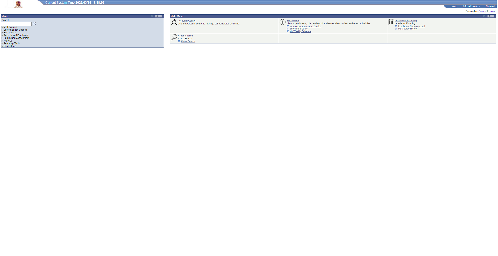
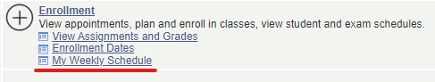
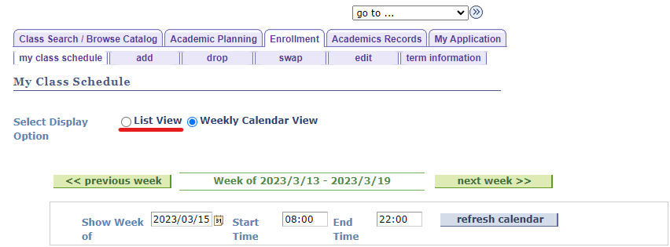
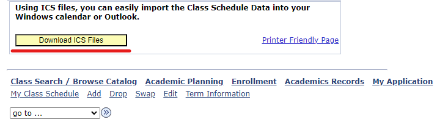

# Export ICS from SIS

## Intro
This tutorial is a tutorial about how to export ICS files from SIS. Please make sure you're connecting to CUHK(SZ) campus Wi-Fi/Wired LAN before your trial to connect. If you have connection difficulties feel free to contact ITSO

## Start
- Access SIS through i.cuhk.edu.cn or anyway you like
- Choose language as usual and proceed usual steps until you reach this main page

- Now Click `My Weekly Schedule` (Under `Enrollment`)
  

- Then click `List View`

- Scroll down to the bottom and you can see the big yellow polished shining button

- After Click you may see this

- Wait for the browser download the `zip` for you. Unzip the file and get a folder named `Class_Schedule_Data_StuID_Term`, use that as the folder to drag to the window of this script.

    ## THE END