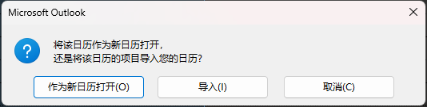

# How To Import ICS to Outlook?

## Intro
We will get to the simplified general method of importing ICSs. If there's something confusing, Please check these:

 [Official Reference (Desktop)](https://support.microsoft.com/en-us/office/import-calendars-into-outlook-8e8364e1-400e-4c0f-a573-fe76b5a2d379)

 [Official Reference (Web)](https://support.microsoft.com/en-us/office/import-or-subscribe-to-a-calendar-in-outlook-on-the-web-503ffaf6-7b86-44fe-8dd6-8099d95f38df)

What's more, the school account doesn't support desktop Office license. If you're trying to import the ICS to your school account calendar, please use [Microsoft 365 online](portal.office365.com) and fetch the Outlook web on the left side bar.

## Outlook Web
This is a better option if you want to import the ICS to an existing calendar but not your default one.

- After reaching the main page of Outlook Web, click the calendar icon on your left side bar.
- If you're trying to import the ICS to an existing calendar but not your default one, click `Add calendar`
- Click `Create new calendar`, choose the left on your own, click `save`
- Then click `Add calendar`, Click `Upload from file`, Choose your file
- Choose the calendar you want your schedule to be located in.
- Click `Import`

    **Finished!**

    Now check your calender, tick the new calendar and you can see the events.

## Outlook Desktop
This is a better option if you want to import the ICS to a brand new calendar or just your default one.

We have at least two ways to import an ICS to Outlook.

A. Double click the ICS and open with Outlook

B. Use the Import/Export Menu of Outlook

Method A is very simple, so let's take a look at B.

- Click `File` in Outlook
- Choose `Open & Export` option
- Choose `Import/Export`
- Choose `Import iCalendar file or vCalendar file`
- Choose target file

Until here we reach the confluence of two ways. Outlook will provide an option:

Choose:

- Open as a new calendar: Meaning that the ICS is imported as a new "folder" of events. You should notice that if you have logged in your school account to your phone and sync the calendar, the calendar synced is only your default personal calendar rather than every calendars.
- Import: This is to import the events in ICS to your default calendar. If you're syncing your calendar across devices, please choose this option.
- Cancel: Choose this if you're giving up to do so.

After that the events are imported. You can see them in your calendar view.